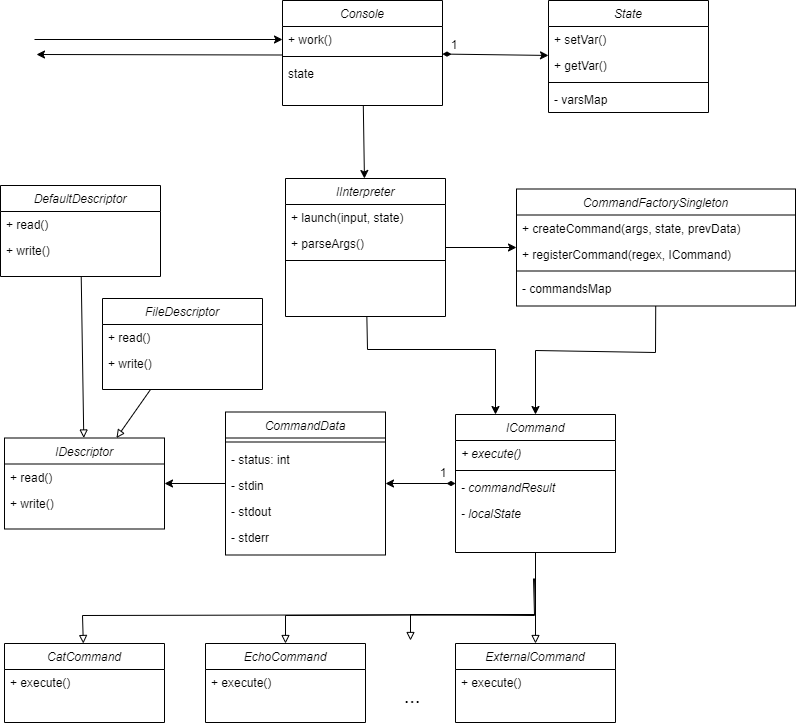

# itmo_se
Курс по Проектированию ПО. Весенний семестр 2024.

# Сбор и запуск системы
* Разработка велась на языке Java-21
* Для сборки необходимо выполнить команду `./gradlew build`
* После этого исполняемый файл, находящийся в дирректории `./build/lib` необходимо запустить, например,
с помощью `java -jar ./build/lib/itmo-se.jar`

# Элементы UML-диаграммы
* Console -- точка входа и выхода.
  * Считывает пользовательский ввод
  * Держит в себе состояние системы (консоли)
  * Использует интерпретатор для выполнения пользовательского скрипта
  * Результат выполнения очередного скрипта -- CommandData

* State -- состояние. Пользовательские переменные. Общие данные для всех интерпретаторов. Возможно стоит сделать как взаимодействие с файлом (чтобы разделяться между многими консолями, Аналог Path)

* Interpreter -- интерпретатор.
  * Определяет команды и вычислят аргументы для них (full and weak quoting, подставляет переменные)
  * Создает команды, используя фабрику
  * Настраивает потоки ввода-вывода для команды или конвейера команд
  * Исполняет команды, передает им состояния
  
* CommandFactory -- объект-фабрика
  * Ответственна за вызов необходимых конструкторов при инициализации команд
  * Поиск и регистрация команд по (@обдумывается@ регулярным выражениям).
  * Порядок регистрации совпадает с порядком проверок
  * Создается и заполняется доступными командами при создании объекта-консоли

* BaseCommand -- базовая команда (абстрактный класс)
  * От неё наследуются конкретные команды
  * У всех наследников есть конструктор с одинаковыми аргументами (массив строк)
  * Общие поля для всех команд (дескрипторы, )
  * Хранит ссылку на некоторое состояние системы (может быть локальное)

* AnyCommand
  * При вызове перенаправляет ввод-вывод в свои дескрипторы (например, временные файлы)
  * Делает это в случае, если они не установлены явно
  
* CommandData -- структура
  * Хранит информацию о потоках ввода-вывода
  * Хранит статус выполнения команды (Exit, ErrorCode, Ok, etc...)

* IDescriptor -- поток ввода-вывода. Интерфейс
  * Может быть стандратным потоком
  * Может быть перенаправлен в файл

# Use-case

* `echo "Some String to Pring" | wc`
* `a=text.txt`
* `echo $a | wc` -- вызов `wc` для файла `text.txt`
* `wc < $a`, `wc < $a > res.txt`, `catawg 2> | echo $a`