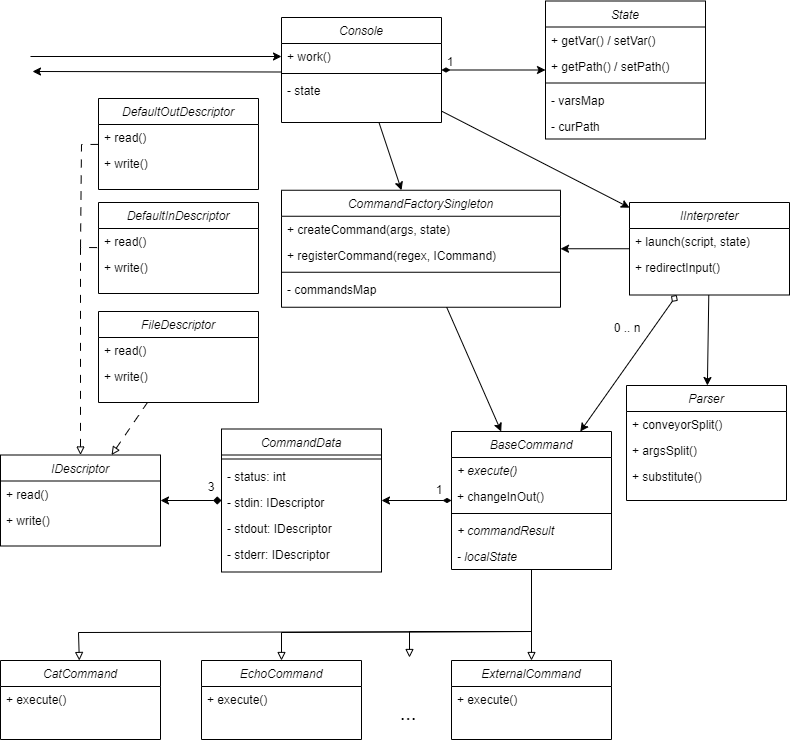

# itmo_se
Курс по Проектированию ПО. Весенний семестр 2024.

# Сбор и запуск системы
* Разработка велась на языке Java-21
* Для сборки необходимо выполнить команду `./gradlew build`
* После этого исполняемый файл, находящийся в дирректории `./build/lib` необходимо запустить, например,
с помощью `java -jar ./build/lib/itmo-se.jar`

# Элементы UML-диаграммы
* Console -- точка входа и выхода.
  * Ответственна за считывание пользовательского ввода
  * Держит в себе состояние системы (консоли)
  * Использует интерпретатор для выполнения пользовательского скрипта
  * Результат выполнения очередного скрипта -- CommandData
  * При получении кода от команды `exit` завершает свое выполнение и возвращает статус выполнения последней до неё команды или цепочки команд 

* State -- состояние
  * Хранит пользовательское окружение. Предоставляет доступ на его чтение и изменение
  * Хранит текущую дирректорию

* Parser -- парсинг входных данных
  * Разбивает пользовательский ввод на участки конвейера
  * Разбивает строку на аргументы
  * Выполняет подстановку, full and weak quoting
  
* Interpreter -- интерпретатор пользовательского ввода
  * Принимает пользовательский ввод и создает команды, используя фабрику. Настраивает их
  * Порядок парсинга и подстановок в интрерпретаторе
    1. Пользовательский ввод разбивается на участки конвейера
    2. Участок конвейера разбивается на аргументы (массив строк)
    3. Выполняется подстановка, а также full и weak quoting
    4. Выполняется перенаправление ввода вывода
    5. Вызывается выполнение команды на оставшихся аргументах (перенаправление потоков не относится к аргументам команды)
  * В результате этого
    * Аргументы команды фиксируются после подстановки
    * Команда не ответственна за перенаправление ввода-вывода и не принимает эту часть аргументов
  
* CommandFactory -- объект-фабрика
  * Ответственна за вызов необходимых конструкторов при инициализации команд
  * Поиск и регистрация команд по (@обдумывается@ регулярным выражениям).
  * Порядок регистрации совпадает с порядком проверок
  * Создается и заполняется доступными командами при создании объекта-консоли

* BaseCommand -- базовая команда (абстрактный класс)
  * От неё наследуются конкретные команды
  * У всех наследников есть конструктор с одинаковыми аргументами (массив строк)
  * Общие поля для всех команд (дескрипторы, )
  * Хранит ссылку на некоторое состояние системы (может быть локальное)

* AnyCommand
  * Вызывается для команды, не зарегистрированной в консоли
  * При вызове перенаправляет ввод-вывод в свои дескрипторы (например, временные файлы)
  * Делает это в случае, если они не установлены явно
  
* CommandData -- структура
  * Хранит информацию о потоках ввода-вывода
  * Хранит статус выполнения команды (Exit, ErrorCode, Ok, etc...)

* IDescriptor -- поток ввода-вывода. Интерфейс
  * Может быть стандратным потоком
  * Может быть перенаправлен в файл

# Use-case

* `echo "Some String to Pring" | wc`
* `a=text.txt`
* `echo $a | wc` -- вызов `wc` для файла `text.txt`
* `wc < $a`, `wc < $a > res.txt`, `catawg 2> | echo $a`